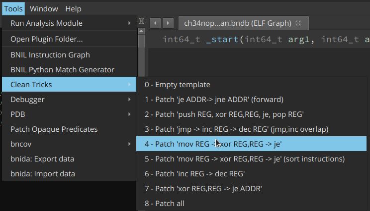
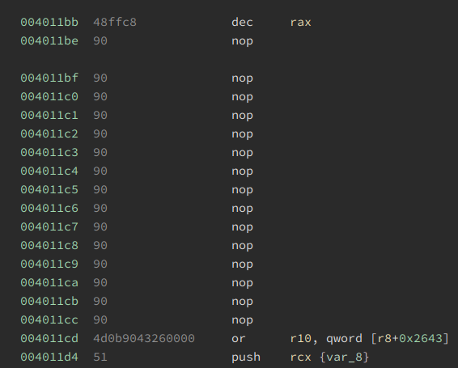

# CleanTricks
Binary Ninja plugin to clean up some common obfuscation techniques (dirty tricks).
There is an empty template included as well to be able to easily add your own, because there are many many obfuscations out there. However, often they get reused or slightly modified, and then it is useful to have a starting point/example.
Pull requests are very welcome.

More details available at: 

https://www.janbeck.com/cybersecurity-challenges-ctfs-and-more/cleantricks-to-deal-with-dirty-tricks-binary-ninja-deobfuscation-plugin

But as a simple example of what this is for, consider the following code:

The overlapping code is hidden in the literal value, `0x5ebcbff49c3ff49`. It simply increases `r11`, then decreases it again, then jumps to the address right behind the `JZ` check. I have come across a binary that uses this same trick  on different registers thousands of times. This plugin allows automating this patch:

And then, after the patch, the code is much simpler. In many cases this allows binary ninja to reanalyze the program flow into a much more convienient form.

